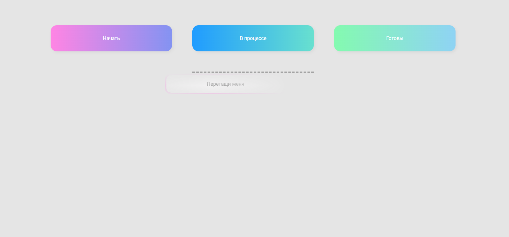

# 5 проектов на JavaScript
 ## [Ссылка на готовый проект](https://oalbukova.github.io/pet-project/)
> Все страницы являются адаптивными и кроссбраузерными

###  Oчень красивый плагин раскрывающихся карточек
>  Оптимальный вариант для предложения различных товаров

[]

###  Drag & Drop, мини-клон Trello
>  Подходит для перетаскивания товаров в корзину или task-трекера

[]

###  Слайдер картинок
>  Вариант представления услуг или фотографий

[]

###  Визуальная мини-игра с динамической генерацией контента
>  Освоение динамической генерации и оптимизации работы с JS

[]

###  Игра "Aim Game" с 3мя экранами
>  Работа с анимацией, таймером и функционалом полноценной игры

